# Mars-Analog Helicopter Landing Safety Boxes

<p align="center">
  <strong>Poisson safety fields · HOCBF collision avoidance · CLF landing stabilization · multi-zone contingency · verified minimum-intervention filtering</strong>
</p>

<p align="center">
  A modular research framework for converting complex three-dimensional occupancy geometry into differentiable safety certificates and safe landing commands for a reduced-order aerial vehicle.
</p>

<p align="center">
  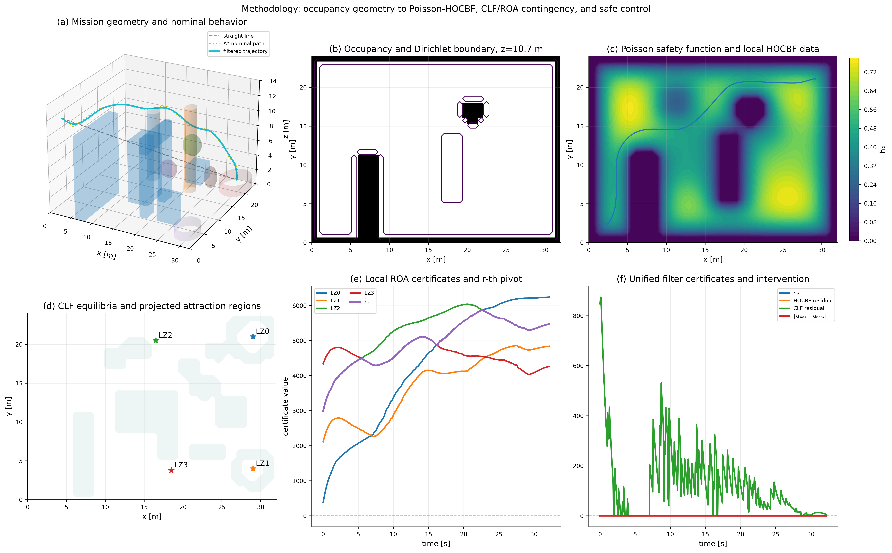
</p>

> **Current scope.** The paper experiments use deterministic three-dimensional single- and double-integrator models with known state, static occupancy, and ideal low-level command tracking. The repository does **not** yet claim full-order PX4, estimator, hardware, uncertain-terrain, or Martian-aerodynamics guarantees.

---

## 1. Research objective

A planetary aerial vehicle must do more than avoid an obstacle. It must descend through cluttered terrain, converge to a landing equilibrium, retain viable backup sites, retarget when the active site becomes unavailable, and stop when the configured contingency requirement can no longer be supported.

This repository studies the coupled problem

$$
\text{environment geometry}
\longrightarrow\
\text{smooth environmental safety}
\longrightarrow\
\text{landing stabilization}
\longrightarrow\
\text{multi-zone contingency}
\longrightarrow\
\text{verified safe command}.
$$

The implementation separates each mathematical responsibility into a **safety box** with explicit inputs, outputs, tests, and diagnostic residuals.

| Requirement | Mathematical object | Owning package |
|---|---|---|
| Complex obstacle geometry | occupancy domain $\Omega$ and boundary $\partial\Omega$ | `poisson_safety_box` |
| Smooth environmental certificate | Poisson safety function $h_P$ | `poisson_safety_box` |
| Dynamic collision avoidance | CBF/HOCBF inequality | `cbf_safety_box` |
| Landing convergence | target-specific CLF $V_j$ | `clf_safety_box` |
| Candidate attraction region | sublevel set $\mathcal R_j(c_j)$ | `clf_safety_box` |
| Backup-site logic | $r$-out-of-$p$ pivot $\widetilde h_r$ | `contingency_safety_box` |
| Minimum intervention | constrained projection of $u_{\mathrm{nom}}$ | `safety_filter_box` |
| Shared contracts | states, certificates, decisions, constraints, results | `safety_box_core` |

---

## 2. System architecture

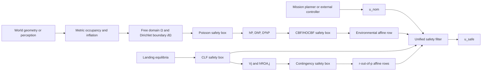

The nominal planner is intentionally separate from the certificate layers. A planner may improve progress, but formal environmental safety is represented by the Poisson-HOCBF row, while landing stabilization and contingency are represented by CLF-derived rows.

---

# Approach

## 3. Reduced-order vehicle model

The main paper experiments use a three-dimensional double integrator:

$$
\dot p=v, \qquad \dot v=a,
$$

with

$$
x=
\begin{bmatrix}
p\\ v
\end{bmatrix}
\in\mathbb R^6,
\qquad
u=a\in\mathbb R^3.
$$

The generic safety-box contracts remain compatible with a control-affine system

$$
\dot x=f(x)+g(x)u.
$$

This separation allows the environment and contingency layers to remain unchanged when the reduced-order model is replaced.

**Implementation:** `experiments/common/simulation.py`, `clf_safety_box/src/clf_safety_box/models.py`.

---

## 4. Occupancy-to-Poisson safety synthesis

### 4.1 Domain construction

A metric occupancy tensor $O$ is generated from the analytic world, an image, or a video stream. Obstacle inflation accounts for the vehicle footprint and configured perception margin. Free cells induce the open computational domain $\Omega$; obstacle surfaces and the outer workspace boundary induce $\partial\Omega$.

### 4.2 Dirichlet problem

The Poisson box solves

$$
\begin{cases}
\Delta h_P(y)=f_P(y), & y\in\Omega,\\
h_P(y)=0, & y\in\partial\Omega,
\end{cases}
$$

where $f_P(y)<0$ is a configurable forcing function. The solution provides

$$
h_P(y), \qquad D h_P(y), \qquad D^2 h_P(y).
$$

The boundary encodes obstacle geometry; the forcing function shapes the interior safety landscape and its derivatives.

Supported forcing methods:

```text
constant
distance
average_flux
guidance
```

Supported solvers:

```text
sparse_direct
conjugate_gradient
sor
```

<p align="center">
  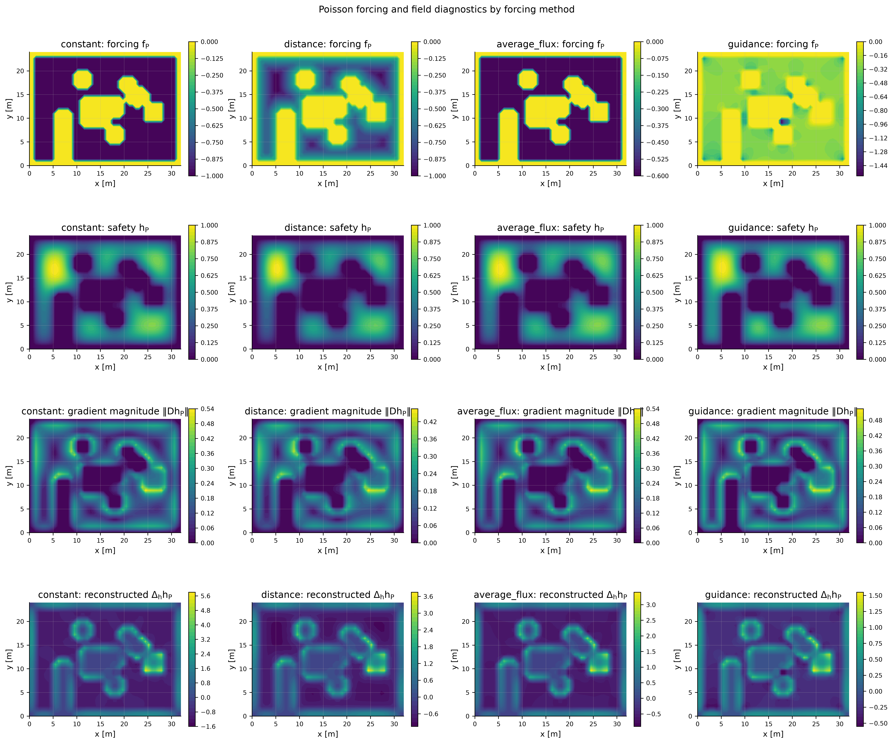
</p>

The implementation reports the assembled-system residual, reconstructed finite-difference residual, field error against a reference solver, derivative timing, and total wall time. This distinguishes PDE discretization error from linear-solver error.

**Implementation:** `poisson_safety_box/`, `experiments/common/poisson_field.py`.

---

## 5. Environmental HOCBF

For a spatial safety function $h_P(p)$ and the double-integrator model,

$$
\dot h_P=D h_P(p)v,
$$

$$
\ddot h_P=D h_P(p)a+v^\top D^2h_P(p)v.
$$

Using linear class-$\mathcal K$ gains $\gamma_1,\gamma_2>0$, the relative-degree-two environmental constraint is

$$
D h_P(p)a
+v^\top D^2h_P(p)v
+(\gamma_1+\gamma_2)D h_P(p)v
+\gamma_1\gamma_2h_P(p)
\ge 0.
$$

Equivalently, the acceleration decision must satisfy

$$
D h_P(p)a
\ge
-v^\top D^2h_P(p)v
-(\gamma_1+\gamma_2)D h_P(p)v
-\gamma_1\gamma_2h_P(p).
$$

The CBF package receives a local sample $(h_P,Dh_P,D^2h_P)$ and returns an affine constraint row. It does not own the Poisson solve or the mission objective.

**Implementation:** `cbf_safety_box/cbf_safety_box/constraints/acceleration_hocbf.py`.

---

## 6. Landing CLFs

Each landing site $j$ defines a controlled equilibrium

$$
x_j^\star=
\begin{bmatrix}
p_j^\star\\ 0
\end{bmatrix}.
$$

For the error $e_j=x-x_j^\star$, a stabilizing feedback gain $K_j$ defines

$$
A_{\mathrm{cl},j}=A-BK_j.
$$

Given $Q_j\succ0$, the CLF box solves

$$
A_{\mathrm{cl},j}^\top P_j+P_jA_{\mathrm{cl},j}=-Q_j
$$

and constructs

$$
V_j(x)=e_j^\top P_je_j.
$$

The active landing target is regulated through

$$
L_fV_j(x)+L_gV_j(x)u
\le
-\alpha_{V,j}\!\left(V_j(x)\right)+\delta_V,
$$

where $\delta_V\ge0$ is an explicitly penalized stability relaxation. Environmental safety and contingency rows remain hard constraints.

<p align="center">
  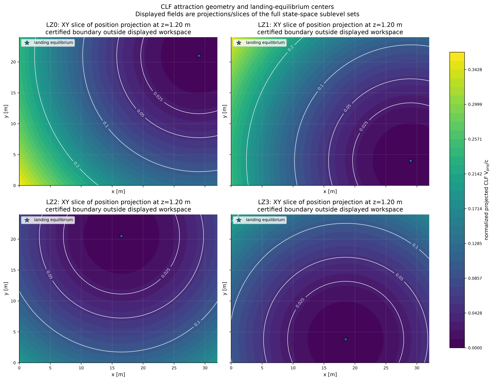
</p>

**Implementation:** `clf_safety_box/src/clf_safety_box/`.

## 7. Candidate attraction regions and contingency

For each candidate landing site $j\in\{1,\ldots,p\}$, the corresponding local Control Lyapunov Function defines a candidate attraction region through the sublevel set

```math
\mathcal{R}_j(c_j)
=
\left\{
x\in\mathbb{R}^{n}
\mid
V_j(x)\leq c_j
\right\},
```

where $c_j>0$ determines the size of the CLF sublevel set associated with the equilibrium $x_j^\star$.

The same region can be represented as the zero-superlevel set of the certificate

```math
h_j^{\mathrm{ROA}}(x)
=
c_j-V_j(x).
```

Therefore,

```math
h_j^{\mathrm{ROA}}(x)\geq 0
\quad\Longleftrightarrow\quad
x\in\mathcal{R}_j(c_j).
```

A positive value of $h_j^{\mathrm{ROA}}$ indicates that the current state lies inside the candidate CLF sublevel set. A negative value indicates that the state lies outside that region.

### 7.1 Combinatorial contingency requirement

Assume that the mission contains $p$ candidate landing zones and requires at least $r$ of them to remain certified. The candidate certificate values are

```math
\left\{
h_1^{\mathrm{ROA}}(x),
h_2^{\mathrm{ROA}}(x),
\ldots,
h_p^{\mathrm{ROA}}(x)
\right\}.
```

Define the combinatorial pivot as

```math
\widetilde{h}_r(x)
=
\max\nolimits^{(r)}
\left\{
h_1^{\mathrm{ROA}}(x),
\ldots,
h_p^{\mathrm{ROA}}(x)
\right\},
```

where $\max^{(r)}$ denotes the $r$-th largest value among the $p$ candidate certificates.

The combinatorial contingency condition is

```math
\widetilde{h}_r(x)\geq 0.
```

This condition holds if and only if at least $r$ candidate certificates are nonnegative. Equivalently, the state belongs to at least $r$ candidate CLF sublevel sets.

The resulting combinatorial set is

```math
\mathcal{C}_r
=
\left\{
x\in\mathbb{R}^{n}
\mid
\widetilde{h}_r(x)\geq 0
\right\}.
```

Special cases include

```math
r=1
\quad\Longrightarrow\quad
\text{at least one candidate remains certified},
```

and

```math
r=p
\quad\Longrightarrow\quad
\text{all candidate regions must remain certified}.
```

### 7.2 Smooth combinatorial constraints

Direct differentiation of the pivot is difficult because the identity of the $r$-th largest certificate can change as the state evolves. Instead of differentiating the nonsmooth order statistic directly, the controller imposes one smooth inequality for every candidate landing zone:

```math
\dot{h}_j^{\mathrm{ROA}}(x,u)
\geq
-\alpha_c
\left(
h_j^{\mathrm{ROA}}(x)
\right)
-
\omega
\rho
\left(
h_j^{\mathrm{ROA}}(x)
-
\widetilde{h}_r(x)
\right),
\qquad
j=1,\ldots,p.
```

The shared auxiliary variable satisfies

```math
\omega\geq 0.
```

Here:

- $\alpha_c$ is an extended class-$\mathcal{K}$ function controlling the admissible decrease of each candidate certificate;
- $\rho$ weights each certificate according to its position relative to the current pivot;
- $\omega$ is shared by all candidate constraints and enables the smooth combinatorial composition.

Candidates whose certificate values are close to the pivot determine whether the $r$-out-of-$p$ condition is maintained. Candidates far above the pivot remain comfortably certified, while candidates far below it do not determine the current contingency boundary.

For the control-affine reduced-order dynamics

```math
\dot{x}
=
f(x)+g(x)u,
```

the derivative of each attraction-region certificate is

```math
\dot{h}_j^{\mathrm{ROA}}(x,u)
=
\nabla h_j^{\mathrm{ROA}}(x)^{\mathsf{T}}
\left(
f(x)+g(x)u
\right).
```

Because

```math
h_j^{\mathrm{ROA}}(x)
=
c_j-V_j(x),
```

its gradient is

```math
\nabla h_j^{\mathrm{ROA}}(x)
=
-\nabla V_j(x).
```

For the quadratic CLF

```math
V_j(x)
=
\left(
x-x_j^\star
\right)^{\mathsf{T}}
P_j
\left(
x-x_j^\star
\right),
```

the gradient becomes

```math
\nabla V_j(x)
=
2P_j
\left(
x-x_j^\star
\right),
```

and therefore

```math
\nabla h_j^{\mathrm{ROA}}(x)
=
-2P_j
\left(
x-x_j^\star
\right).
```

These expressions allow every combinatorial row to be written as an affine constraint in the control input whenever the system dynamics are control-affine.

### 7.3 Target availability and state certification

The implementation distinguishes between two different concepts:

1. **Availability:** whether a landing zone has been declared operational by the mission logic.
2. **Certification:** whether the current state satisfies the corresponding CLF sublevel certificate.

A landing zone may be physically available but not certified from the current state. Conversely, a zone may have a positive CLF margin but be removed from consideration after an external failure declaration.

The active contingency set is therefore determined using both logical availability and state-dependent certificate values.

### 7.4 Target failure and safe retargeting

When the active landing zone becomes unavailable, the target manager evaluates the remaining candidates and selects an alternative with a valid certificate and adequate contingency margin.

The desired behavior is

```text
approach active landing zone
→ detect landing-zone failure
→ remove failed zone from the available set
→ evaluate remaining CLF certificates
→ select a certified alternative
→ continue the safety-filtered approach
```

If fewer than $r$ available and certified alternatives remain, the requested contingency guarantee can no longer be maintained. The mission manager must then trigger a safe fallback mode instead of claiming that the original $r$-out-of-$p$ property still holds.

<p align="center">
  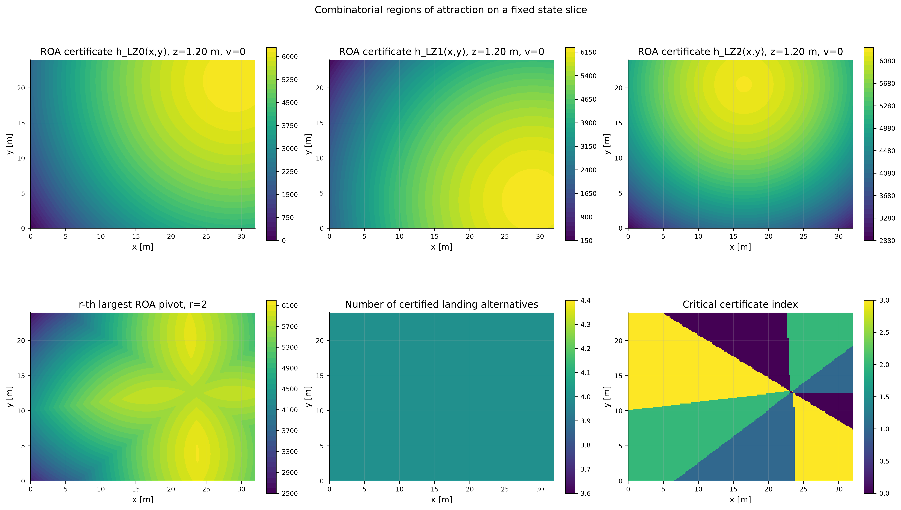
</p>

<p align="center">
  <em>
    Candidate CLF sublevel certificates and the corresponding
    r-out-of-p contingency pivot evaluated over a spatial slice of
    the full state space.
  </em>
</p>

> **Interpretation of the spatial plots.** The complete CLF sublevel sets are defined in the full position–velocity state space. For the three-dimensional double-integrator model, the state space is six-dimensional. The spatial ellipses, ellipsoids, and maps shown above are fixed-velocity slices or projections and must not be interpreted as complete six-dimensional attraction regions.

> **Current validation scope.** The implementation computes quadratic CLF sublevel certificates, evaluates their $r$-out-of-$p$ composition, and supports landing-zone invalidation and retargeting. A formal region-of-attraction claim additionally requires verifying that every selected sublevel set lies inside the domain where the local CLF decrease condition, input feasibility, model assumptions, and environmental safety constraints are jointly valid.

**Implementation:** [`contingency_safety_box/src/contingency_safety_box/`](contingency_safety_box/src/contingency_safety_box/)

## 8. Unified minimum-intervention filter

All certificate packages use the affine convention

$$
Az\ge b.
$$

When environmental safety, landing stability, and contingency are active, the augmented decision is

$$
z=
\begin{bmatrix}
a\\ \omega\\ \delta_V
\end{bmatrix}.
$$

The filter solves

$$
\begin{aligned}
\min_{a,\omega,\delta_V}\quad
&\frac12\|a-a_{\mathrm{nom}}\|_R^2
+c_\omega\omega^2
+p_V\delta_V^2\\
\text{s.t.}\quad
& a_{\min}\le a\le a_{\max},\\
& \text{Poisson-HOCBF environmental row},\\
& \text{active-target CLF row},\\
& \text{combinatorial attraction-region rows},\\
& \omega\ge0,\qquad \delta_V\ge0.
\end{aligned}
$$

The returned solution is accepted only after independent residual verification. The runtime does not repair an infeasible result by clipping it after optimization.

**Implementation:** `safety_filter_box/src/safety_filter_box/`.

---

## 9. Safety-box contracts

| Safety box | Input | Output | Scientific responsibility |
|---|---|---|---|
| `poisson_safety_box` | occupancy, spacing, forcing, solver | $h_P$, $Dh_P$, $D^2h_P$, residuals, timings | construct a differentiable environmental safety representation |
| `cbf_safety_box` | state and local safety sample | affine CBF/HOCBF rows | convert the safety representation into dynamic constraints |
| `clf_safety_box` | model, equilibria, LQR/CLF settings | $V_j$, $P_j$, $K_j$, $c_j$, CLF rows | stabilize landing equilibria and define candidate sublevel sets |
| `contingency_safety_box` | differentiable candidate certificates, availability, $r$ | pivot, certified count, combinatorial rows, retarget status | preserve or assess multiple landing alternatives |
| `safety_filter_box` | nominal decision, bounds, constraint bundles | verified `FilterResult` and $u_{\mathrm{safe}}$ | solve the unified minimum-intervention problem |
| `safety_box_core` | shared typed objects | canonical contracts | prevent incompatible state and constraint representations |

<details>
<summary><strong>Key implementation files</strong></summary>

| File | Responsibility |
|---|---|
| `poisson_safety_box/poisson_safety_box/matrix.py` | sparse finite-difference operator assembly |
| `poisson_safety_box/poisson_safety_box/forcing.py` | forcing-field construction |
| `poisson_safety_box/poisson_safety_box/solver.py` | direct, CG, and SOR backends |
| `poisson_safety_box/poisson_safety_box/derivatives.py` | gradient, Hessian, and Laplacian diagnostics |
| `cbf_safety_box/cbf_safety_box/api.py` | reusable CBF/HOCBF adapter |
| `cbf_safety_box/cbf_safety_box/constraints/acceleration_hocbf.py` | relative-degree-two HOCBF |
| `clf_safety_box/src/clf_safety_box/quadratic.py` | LQR, Lyapunov equation, and sublevel threshold |
| `clf_safety_box/src/clf_safety_box/box.py` | multi-target CLF evaluation |
| `contingency_safety_box/src/contingency_safety_box/box.py` | pivot, count, and combinatorial rows |
| `contingency_safety_box/src/contingency_safety_box/policies.py` | target-selection policy |
| `safety_filter_box/src/safety_filter_box/filter.py` | unified assembly, solve, and residual verification |
| `experiments/common/controller.py` | runtime composition of independent boxes |
| `experiments/common/simulation.py` | deterministic rollout and event logging |
| `experiments/predefined_world/run_paper_suite.py` | controlled paper experiment matrix |

</details>

---

# Results

## 10. Paper experiment matrix

The paper suite separates three mission-level questions from the parameter studies.

| Scenario | Scientific question | Expected terminal state |
|---|---|---|
| `baseline` | Can the system avoid terrain and complete the preferred landing? | `landed` at `LZ0` |
| `single_failure` | Can the manager reject the active site, retarget, and complete a diverted landing? | `landed` at a backup site |
| `sequential_failure` | Does the system detect that the configured $r$-out-of-$p$ requirement is exhausted? | contingency-exhaustion trigger |
| parameter sweeps | How do HOCBF gain, CLF gain, ROA scale, forcing, and solver choice affect behavior and computation? | configuration-dependent |

> The current sequential-failure rollout detects exhaustion and terminates immediately. It should not yet be interpreted as a validated physical hover/HOLD maneuver because the vehicle is not simulated until position and velocity converge to a hold equilibrium.

---

## 11. Reference landing results

### 11.1 Obstacle-rich primary landing

The direct start-to-target segment intersects occupied geometry. The nominal planner constructs a clearance-aware reference, and the unified filter produces a safe terminal descent.

<p align="center">
  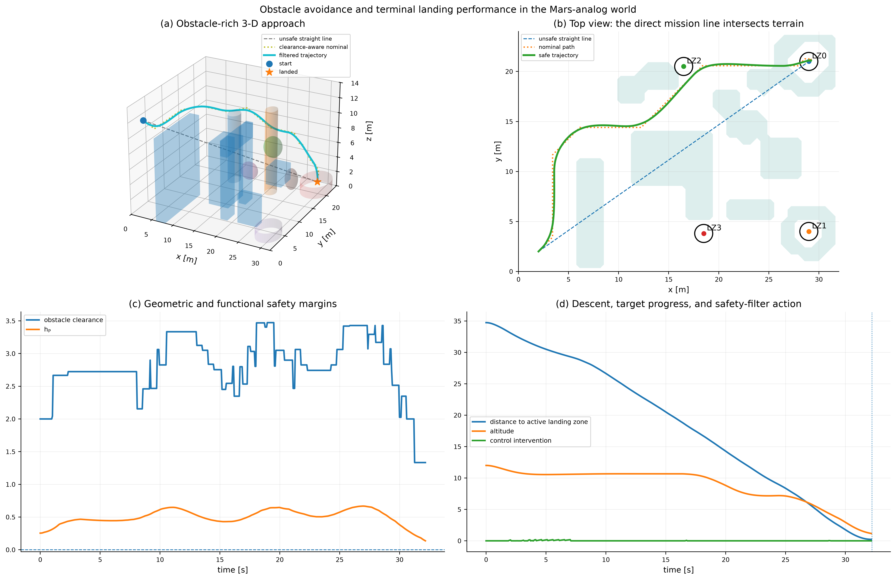
</p>

### 11.2 Terminal landing verification

The terminal figure evaluates the landing conditions directly rather than inferring success from the final plotted marker.

<p align="center">
  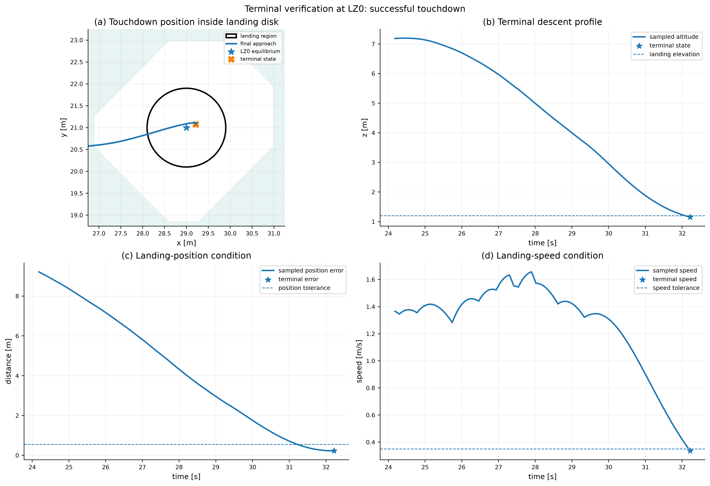
</p>

Reference deterministic run:

| Metric | Baseline | Single failure |
|---|---:|---:|
| terminal status | `landed` | `landed` |
| final target | `LZ0` | `LZ2` |
| final position error | 0.227 m | 0.026 m |
| final speed | 0.336 m/s | 0.328 m/s |
| minimum obstacle clearance | 1.333 m | 0.966 m |
| minimum Poisson value | 0.1368 | 0.0982 |
| minimum HOCBF residual | 0.0498 | $-3.0\times10^{-11}$ |
| target failures | 0 | 1 |
| target switches | 0 | 1 |

The small negative residual in the single-failure run is at numerical tolerance scale and is reported rather than hidden.

---

## 12. Single-failure contingency result

The active target is invalidated during approach. The target manager selects an available candidate with positive CLF-based margin, and the controller completes the redirected landing.

<p align="center">
  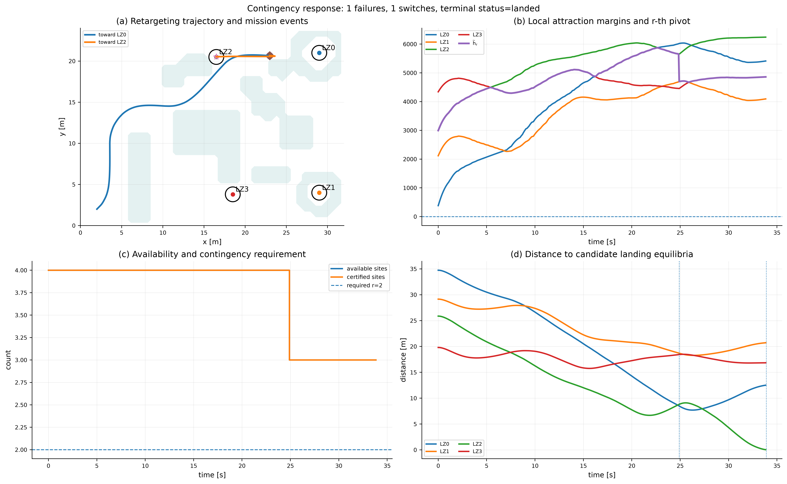
</p>

This result currently supports the claim that the runtime can perform **target invalidation, certified-margin assessment, retargeting, and diverted touchdown**. A stronger claim that the combinatorial rows actively preserved a nontrivial $r$-out-of-$p$ set requires a scenario in which the pivot approaches zero and the shared auxiliary variable $\omega$ becomes active.

---

## 13. HOCBF gain sensitivity

The HOCBF sweep evaluates the safety-performance tradeoff on the same obstacle world. Moderate gains produce successful landings, while overly conservative or aggressive configurations can terminate through residual or sampled-data collision checks.

<p align="center">
  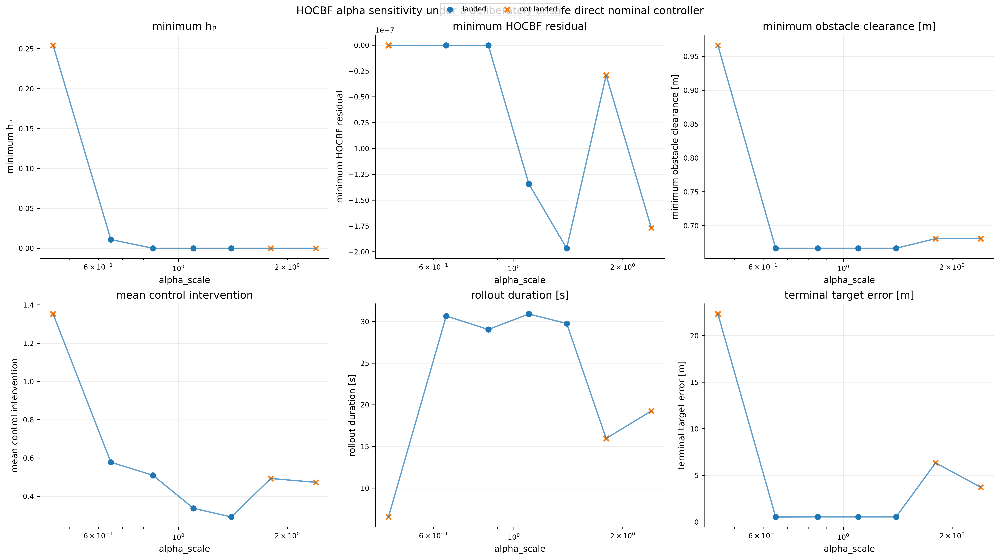
</p>

Reported metrics include terminal status, duration, path length, clearance, minimum $h_P$, minimum HOCBF residual, intervention norm, terminal error, solve-time percentiles, and collision-guard backtracks.

---

## 14. Poisson solver comparison

The same discrete Dirichlet problem is solved with multiple numerical backends. The comparison separates speed from field and algebraic error.

<p align="center">
  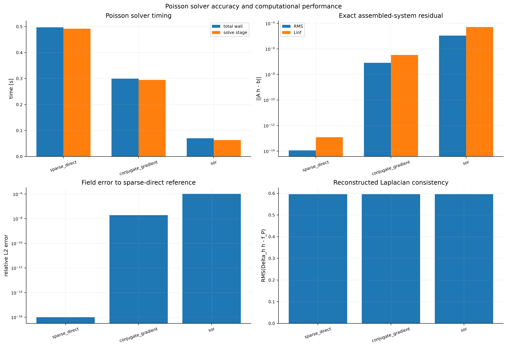
</p>

Reference single-run values:

| Solver | Solve time | Algebraic residual | Relative field error |
|---|---:|---:|---:|
| sparse direct | 0.492 s | $1.14\times10^{-14}$ | reference |
| conjugate gradient | 0.295 s | $8.14\times10^{-8}$ | $1.93\times10^{-8}$ |
| SOR | 0.063 s | $1.10\times10^{-5}$ | $1.03\times10^{-6}$ |

These are deterministic reference values, not statistical timing claims. Publication-grade benchmarking should add repeated trials, grid-resolution scaling, hardware metadata, and dispersion statistics.

---

## 15. Cross-scenario comparison

<p align="center">
  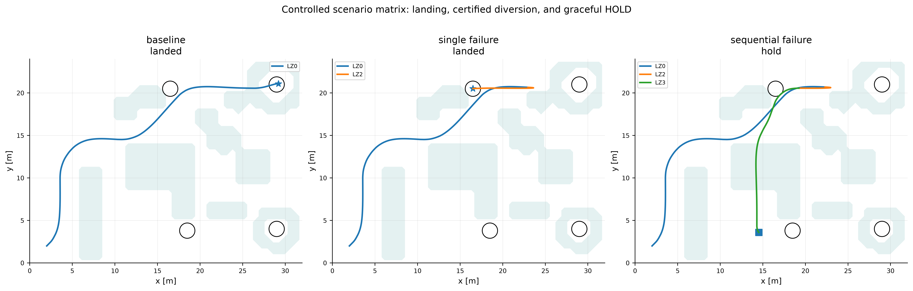
</p>

The scenario comparison is intended as a summary figure. Claim-specific figures and CSV/JSON records remain the primary evidence.

---

## 16. What the current suite demonstrates

**Supported by the current deterministic experiments**

- occupancy-to-Poisson safety construction in a nontrivial 3-D world;
- numerical access to $h_P$, $Dh_P$, and $D^2h_P$;
- HOCBF constraint evaluation and residual logging;
- obstacle-rich preferred-site landing;
- target invalidation followed by redirected landing;
- solver time/error comparison;
- HOCBF, CLF, and ROA parameter studies;
- sub-millisecond pointwise safety-filter solve time in the reference configuration.

**Not yet claimed**

- full-order flight-dynamics safety;
- PX4/SITL or hardware validation for this release;
- robustness to state-estimation, map, delay, and aerodynamic uncertainty;
- real-time recomputation of the full guidance-forcing Poisson field;
- statistically validated success rates;
- active preservation of a nontrivial $r$-out-of-$p$ boundary in the current reference scenario;
- a physically stabilized hover/HOLD maneuver after contingency exhaustion.

This distinction is part of the scientific interface of the repository: a successful software run is not automatically a formal or hardware-level guarantee.

---

## 17. Paper alignment

| Paper section | Repository evidence |
|---|---|
| **Approach: model** | reduced-order dynamics and state/control definitions |
| **Approach: environment** | occupancy, boundary, forcing, Poisson solution, derivatives |
| **Approach: safety** | relative-degree-two HOCBF derivation and affine row |
| **Approach: landing** | target-specific CLFs and candidate sublevel sets |
| **Approach: contingency** | $r$-out-of-$p$ pivot, critical set, availability, and retarget policy |
| **Approach: optimization** | unified minimum-intervention filter and residual verification |
| **Results: landing** | baseline trajectory and terminal-condition verification |
| **Results: diversion** | single-failure contingency timeline and redirected touchdown |
| **Results: sensitivity** | HOCBF/CLF/ROA sweeps |
| **Results: computation** | solver comparison and filter timing |
| **Results: limitations** | explicit claim boundary and missing robustness studies |

The detailed figure plan is in [`docs/PAPER_FIGURE_PLAN.md`](docs/PAPER_FIGURE_PLAN.md).

---

## 18. Reproducibility

### 18.1 Existing project environment

```bash
cd ~/ATMOS/Docker/workspace/Helicopter
source .venv_boxes/bin/activate
bash scripts/run_paper_experiments.sh
```

The script creates a timestamped directory under

```text
outputs/paper/mars_analog_suite_YYYYMMDD_HHMMSS/
```

with

```text
00_cross_scenario_figures/
01_baseline/
02_single_failure/
03_sequential_failure/
04_parameter_sweeps/
PAPER_FIGURE_INDEX.md
paper_scenario_summary.csv
paper_scenario_summary.json
```

### 18.2 Fast end-to-end smoke run

```bash
bash scripts/run_paper_experiments.sh \
  --profile smoke \
  --skip-comparisons \
  --skip-sweeps
```

### 18.3 Fresh local environment named `.venv_boxes`

```bash
python3 -m venv .venv_boxes
source .venv_boxes/bin/activate
python -m pip install --upgrade pip setuptools wheel
python -m pip install -r requirements.txt

for package in \
  safety_box_core \
  safety_filter_box \
  clf_safety_box \
  contingency_safety_box \
  poisson_safety_box \
  cbf_safety_box \
  vision_poisson_experiments
do
  python -m pip install -e "./${package}"
done
```

### 18.4 Project-only tests

On ROS 2 systems, disable unrelated auto-loaded pytest plugins when validating only this repository:

```bash
PYTEST_DISABLE_PLUGIN_AUTOLOAD=1 \
python -m pytest tests -v
```

---

## 19. Repository structure

```text
Helicopter/
├── configs/
│   ├── experiment.yaml
│   └── worlds/mars_analog_landing.yaml
├── experiments/
│   ├── common/
│   ├── predefined_world/
│   ├── static_image/
│   └── live_vision/
├── poisson_safety_box/
├── cbf_safety_box/
├── clf_safety_box/
├── contingency_safety_box/
├── safety_filter_box/
├── safety_box_core/
├── vision_poisson_experiments/
├── scripts/
├── tests/
├── docs/
├── outputs/
└── legacy/hjr/
```

Further documentation:

- [`docs/SCIENTIFIC_WORKFLOW.md`](docs/SCIENTIFIC_WORKFLOW.md): equation-by-equation pipeline;
- [`docs/EQUATION_TO_CODE_MAP.md`](docs/EQUATION_TO_CODE_MAP.md): mathematical object to implementation mapping;
- [`docs/FILE_GUIDE.md`](docs/FILE_GUIDE.md): file responsibilities;
- [`docs/MARS_ANALOG_SCENARIO_DESIGN.md`](docs/MARS_ANALOG_SCENARIO_DESIGN.md): world geometry and scenario rationale;
- [`docs/PAPER_FIGURE_PLAN.md`](docs/PAPER_FIGURE_PLAN.md): Approach and Results figure plan;
- [`docs/SAFETY_SCOPE.md`](docs/SAFETY_SCOPE.md): guarantee and non-guarantee boundary;
- [`docs/MIGRATION_FROM_HJR.md`](docs/MIGRATION_FROM_HJR.md): active CLF-based formulation versus archived HJR code.

---

## 20. Design principles

1. **One mathematical responsibility per box.**
2. **Shared typed contracts instead of experiment-specific data structures.**
3. **Hard environmental and contingency constraints; explicit stability relaxation.**
4. **Independent residual verification after every optimization solve.**
5. **The same geometry source for visualization and occupancy.**
6. **Deterministic configurations, logged metadata, and machine-readable results.**
7. **No safety claim beyond the validated model and experiment scope.**

---

## 21. Citation

Use [`CITATION.cff`](CITATION.cff) for repository citation. The theoretical sources and the mapping from external results to implemented components are documented in [`docs/THEORY_REFERENCES.md`](docs/THEORY_REFERENCES.md).

---

## 22. License and research status

This repository is a research prototype. Review the license files, dependency licenses, and [`docs/SAFETY_SCOPE.md`](docs/SAFETY_SCOPE.md) before reuse in safety-critical or flight applications.
